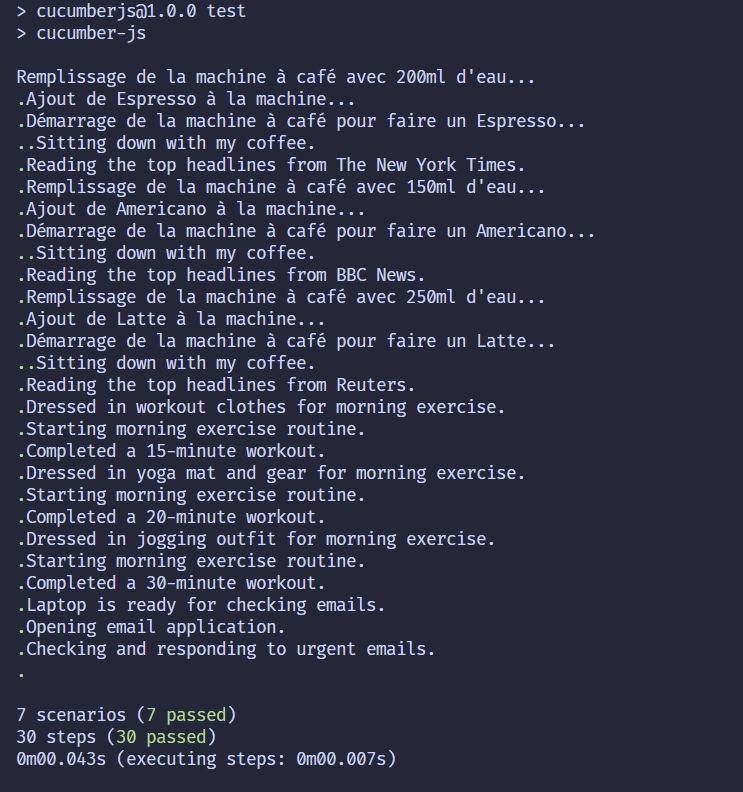

= R5.A.08 -- Dépôt pour les TPs
:icons: font
:MoSCoW: https://fr.wikipedia.org/wiki/M%C3%A9thode_MoSCoW[MoSCoW]

Ce dépôt concerne les rendus de mailto:baptiste.froment@etu.univ-tlse2.fr[Baptiste Froment].

== TP1

.fichier `is_it_friday_yet.feature`
[source,gherkin]
---
Feature: Is it Friday yet?
  Everybody wants to know when it's Friday
  Scenario Outline: Checking if it's Friday
    Given today is "<day>"
    When I ask whether it's Friday yet
    Then I should be told "<answer>"
  Examples:
    | day            | answer |
    | Friday         | TGIF   |
    | Sunday         | No     |
    | anything else! | No     |

---

image::tp1-test.png[width=80%]

== TP2

[source,java]
----
package dojo;

import java.util.ArrayList;
import java.util.List;

public class Order {
    private String owner;
    private String target;
    private List<String> cocktails = new ArrayList<>();

    public void declareOwner(String name) {
        this.owner = name;
    }

    public void declareTarget(String name) {
        this.target = name;
    }

    public List<String> getCocktails() {
        return this.cocktails;
    }

    public String getOwner() {
        return this.owner;
    }

    public String getTarget() {
        return this.target;
    }
}
----
Résultat des tests :

image::tp2.png[width=80%]

== TP3

Voici le fichier contenant la feature :

[source,gherkin]
----
Feature: Morning Routine

  Scenario Outline: Brewing a cup of coffee and Reading Morning News
    Given the coffee machine is filled with "<waterAmount>" of water
    And "<coffeeType>" coffee is added to the machine
    When I press the coffee machine's start button
    Then a hot cup of "<coffeeType>" coffee is brewed
    And I sit down with my coffee
    And I read the top headlines from "<newsSource>"

    Examples:
      | waterAmount | coffeeType | newsSource        |
      | 200ml       | Espresso   | The New York Times|
      | 150ml       | Americano  | BBC News          |
      | 250ml       | Latte      | Reuters           |

  Scenario Outline: Morning Exercise
    Given I am dressed in "<exerciseAttire>"
    When I start my morning exercise routine
    Then I complete a "<exerciseDuration>"-minute workout

    Examples:
      | exerciseAttire   | exerciseDuration |
      | workout clothes  | 15               |
      | yoga mat and gear| 20               |
      | jogging outfit   | 30               |

  Scenario: Checking Emails
    Given I have my laptop ready
    When I open my email application
    Then I check and respond to urgent emails
----
Pour implémenter les test, j'ai utilisé le langage Javascript avec la librairie `cucumber.js`

Voici les tests :

[source,javascript]
----
const { Given, When, Then } = require('@cucumber/cucumber');
const assert = require('assert');
const robot = require('../../robot');

Given('the coffee machine is filled with {string} of water', function (waterAmount) {
  robot.fillCoffeeMachineWithWater(waterAmount);
});

Given('{string} coffee is added to the machine', function (coffeeType) {
  robot.addCoffeeToMachine(coffeeType);
});

When('I press the coffee machine\'s start button', function () {
  robot.pressCoffeeMachineStartButton();
});

Then('a hot cup of {string} coffee is brewed', function (coffeeType) {
  let coffeeIsReady = robot.checkIfCoffeeIsBrewed();
  assert(coffeeIsReady, `A hot cup of ${coffeeType} coffee should be brewed`);
});

Then('I sit down with my coffee', function () {
  console.log("Sitting down with my coffee.");
});

Then('I read the top headlines from {string}', function (newsSource) {
  console.log(`Reading the top headlines from ${newsSource}.`);
  assert.ok(true, `Headlines from ${newsSource} read.`);
});

Given('I am dressed in {string}', function (exerciseAttire) {
  console.log(`Dressed in ${exerciseAttire} for morning exercise.`);
});

When('I start my morning exercise routine', function () {
  console.log("Starting morning exercise routine.");
});

Then('I complete a {string}-minute workout', function (exerciseDuration) {
  console.log(`Completed a ${exerciseDuration}-minute workout.`);
});

Given('I have my laptop ready', function () {
  console.log("Laptop is ready for checking emails.");
});

When('I open my email application', function () {
  console.log("Opening email application.");
});

Then('I check and respond to urgent emails', function () {
  console.log("Checking and responding to urgent emails.");
  assert.ok(true, "Checked and responded to urgent emails.");
});
----

Expliquez l'objectif que vous vous êtes fixé pour ce TP, et comment vous l'avez atteint.

L'objectif de ce TP était de mettre en place des tests pour une feature donnée en utilisé. Pour cela, j'ai utilisé le langage Javascript avec la librairie `cucumber.js`. J'ai donc implémenté les tests en suivant les indications données dans le TP.

Voici le résultat des tests :

