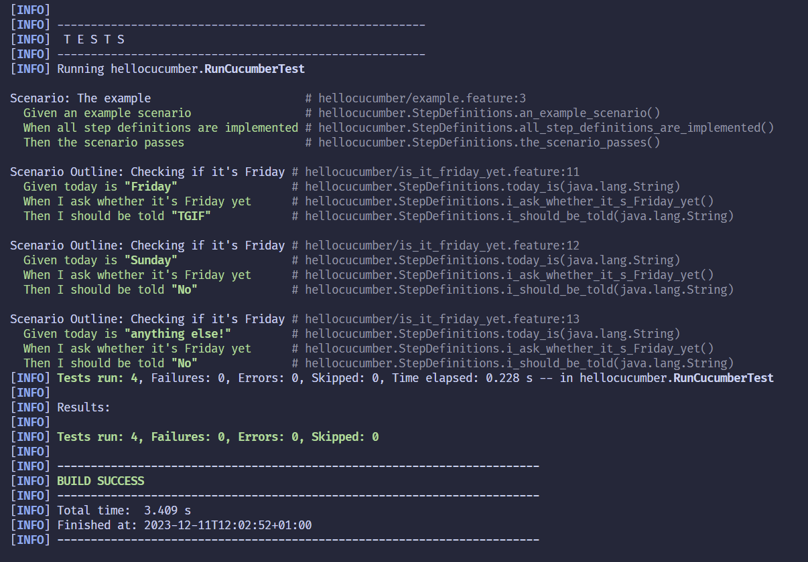
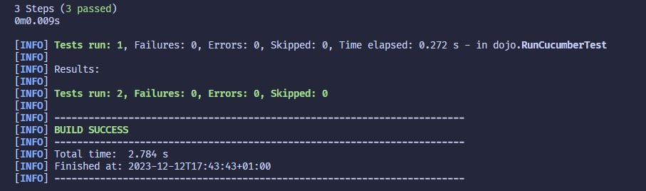

= R5.A.08 -- Dépôt pour les TPs
:icons: font
:MoSCoW: https://fr.wikipedia.org/wiki/M%C3%A9thode_MoSCoW[MoSCoW]

Ce dépôt concerne les rendus de mailto:baptiste.froment@etu.univ-tlse2.fr[Baptiste Froment].

== TP1

.fichier `is_it_friday_yet.feature`
[source,gherkin]
---
Feature: Is it Friday yet?
  Everybody wants to know when it's Friday
  Scenario Outline: Checking if it's Friday
    Given today is "<day>"
    When I ask whether it's Friday yet
    Then I should be told "<answer>"
  Examples:
    | day            | answer |
    | Friday         | TGIF   |
    | Sunday         | No     |
    | anything else! | No     |

---

== TP2

[source,java]
----
package dojo;

import java.util.ArrayList;
import java.util.List;

public class Order {
    private String owner;
    private String target;
    private List<String> cocktails = new ArrayList<>();

    public void declareOwner(String name) {
        this.owner = name;
    }

    public void declareTarget(String name) {
        this.target = name;
    }

    public List<String> getCocktails() {
        return this.cocktails;
    }

    public String getOwner() {
        return this.owner;
    }

    public String getTarget() {
        return this.target;
    }
}
----
Résultat des tests :

